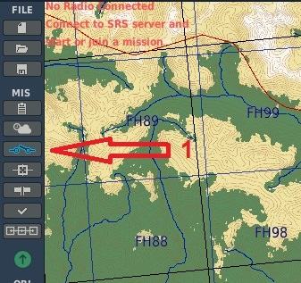
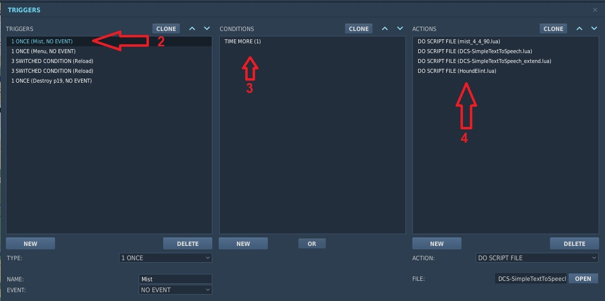

# Hound ELINT system for DCS
## Overview
**Hound ELINT** is a scripted system for DCS. it approximates location of activly transmitting enemy radars by triangulating the radar using one or more assigned assets. Assets can be Airborn, ground units or stationary objects each has it's pros and cons.  

Hound presents data in sevral methods.

1. F10 map markers indicating estimated position of the Radar, with type and accuracy information for tactical decisions. this works best with "My AC" or "Map only" modes
2. Hound offers a Text-To-Speech ATIS system using SRS. This feature provides a radio channel with constantly updated information about current threats.
3. Detailed information by a "SAM controller" can be provided as TTS (via SRS) and as text messages. 

System can gather information about Enemy radar deployments and help understand the tactical situation or penetrate enemy defences. Because the System is asset based, you also need to be protecting these assets, as if they are destroyed, you loose your tactical data.


## Putting this to work
Hound system triangulates positions of radars. It does this by taking bearing readings at set times, while recording the platform position. 
using these plotted data points system can estimate the position. the more points you have, with greater intersection angles between them, there is a better chance of estimating the position correctly. you will never get a perfect "hit" but you may be able to get a position within a 200 meter radius, where you can can use other sensors to poinpoint for a strike, or know where you need to avoid flying.

Only specific units are ELINT capable. In order to get the best positional accuracy you want your best precision platforms positioned as close as possible and as high as possible. Rememeber the higher you go the longer you can see, simple physics.

placing two C-17s going race-track holding patterns at 30,000 ft can get you positional data on radars more then 200nm away, not the best accuracy of course. 
using a Comms Tower placed on a high mountain will provide very accurate baseline on which aircraft data can be triangulated.
However, tall mountains are not very common, and clear line-of-site is a thing. 

Helicopters may be of some use, but they can, using existing mission scripts, transport ground units to tall mountains deep inside enemy terirory.
Same goes to Fast movers like the Viggen or the Su-25T. they can dash into enemy teritory and help you find the radars trying to hide. 

Remember that the system is using a simulated DF to determin the bearing of the radar from the platform. Low precision systems will cause the calculated position to be with a higher ellipse of uncertenty for radar position. below you can find the list of working units and their sensor precision.

``` Note: While currently not implemented. Intention of including both Viggen and the Su-25T is that they will only be able to participate if they are carrying their ELINT and SEAD pods respectivly ```

## Available assets
### Airborn assets
#### Airplanes
---
| Platform  | Precision (degrees)|
| --------  | -------- |
| C-130     | 1.0 |
| C-17      | 1.0 |
| An-30M    | 1.0 |
| Tu-95     | 1.0 |
| Tu-142    | 1.0 |
| IL-76MD   | 1.0 |
| S-3B      | 1.5 |
| E-2D      | 2.0 |
| E-3A      | 2.0 |
| An-26B    | 2.0 |
| A-50      | 2.0 |
| Viggen    | 2.5 |
| Su-25T    | 2.5 |  

#### Helicopters
---
| Platform  | Accuracy (degrees)|
| --------  | --------  |
| CH-47D    | 2.5       |
| CH-53E    | 2.5       |
| MIL-26    | 2.5       |
| UH-60A    | 4.0       |
| SH-60B    | 4.0       |
| Mi-8MT    | 4.0       |
| UH-1H     | 6.0       |
| Ka-27     | 6.0       |

### Ground Units
| Platform  | Accuracy (degrees)|
| --------  | --------  |
| SPK-11    | 0.5       |
| MLRS FDDM | 0.5       |

### Static Objects
| Platform  | Accuracy (degrees)|
| --------  | --------  |
| Comms tower M | 0.15 |

## Can I haz syntax pls?
Yes you can.
### Adding Hound scripts

#### Required external scripts
[MIST (by mrSkortch)](https://github.com/mrSkortch/MissionScriptingTools/releases/latest)  
[DCS-SimpleTextToSpeech (by ciribob)](https://github.com/ciribob/DCS-SimpleTextToSpeech) - Optional (required for TTS)

`
Due to the length of messages, I've written a custom override function for STTS, this needs to be included if you plan on using TTS. Use that file to override TSST directory as instructed in the SimpleTextToSpeech instructions
This will require you to comment out the sanitation in "DCS World/Scripts/MissionScripting.lua"
`

#### adding to the mission
---
``` NOTE the order of scripts - it's important ```  
on a "ONCE" type action with "time more 1" condition, add the scripts in the following order
1. `MIST`
2. `DCS-SimpleTextToSpeech` (if TTS is desired)
3. `DCS-SimpleTextToSpeech_extend.lua` (if TTS is desired)
4. `HoundElint.lua`

#### some screenshot as hints
  




### Adding Hound system to your mission scripts
```lua
    Elint_blue = HoundElint:create()
```
will crate the system instance. Alternatively, you can crate the system with a platform.
```lua
    Elint_blue = HoundElint:create("Migariya_Elint")
```
You will add units by using their names (or pilot name) not by a group name.

Additional platforms can be added at any time
```lua
    Elint_blue:addPlatform("ELINT_C17")
```
and if need be the oposite is also available
```lua
    Elint_blue:removePlatform("ELINT_C17")
```

Thats it, all you need to do now is to activate the system
```lua
    Elint_blue:systemOn()
```
Once activated the system will use all avaliable platforms to locate transmitting radars. 
Information about these radars is updated periodicly onto the F10 map.

` Note: during this first implementation, markers are updated every 2 minutes`

You can of course turn it off for any reason with:
```lua
    Elint_blue:systemOff()
```

### More advanced fun stuff
#### Map markers
---
Hound uses Map markers to indicate the estimated position of the radar tracket. It's a product of the system, and only contains data user can get from the system in other ways. (equvilant to making marks on a paper map)

However, some mission designers may want to disable the markers. 

```lua
HoundElint:enableMarkers()
```
and
```lua
HoundElint:disableMarkers()
```
#### ATIS system
---
As mentioned Hound includes Text-To-Speech using SRS. You players can recive updates via their radio.
Default frequency for ATIS is 250.500 AM.
This feature can be activated using:
```lua
    Elint_blue:enableATIS()
```
and turned off with
```lua
    Elint_blue:disableATIS()
```

system can be configured some more, but more on that later

By default system will only report number of EWR radars tracked. you can activate EWR detailed report by setting the ATIS internal `reportEWR` to true
```lua
Elint_blue.atis.settings.reportEWR = true
```

#### SAM controller
---
Like the ATIS this is also an TTS system using SRS (defaults to 250.00 AM). This functinality allows users to recive a detailed description of a specific radar (with extended information) by selecting that radar from the F10 menu.
This functinality is available also via the standard DCS text notification interface.

```lua
    -- Elint_blue:enableController([showText|bool])

    -- so with text:
        Elint_blue:enableController(true)
    
    -- or withouth
        Elint_blue:enableController(false)

    -- default is "false"
        Elint_blue:enableController()

```

and of course
```lua
    Elint_blue:disableController()
```

` Note: during this first implementation, menus are updated every 1 minute`

#### Transmitter Unit (or static Object)
Both ATIS system and SAM controller both support a transmitter unit. This assigned unit will broadcast over SRS which respects unit's LOS and transmitter range. so ground unit will have terrain masking and add some intrest. 
if Transmitter unit is destroyed no Transmissions will be made until a new transmitter Unit is assinged.

You can assign (and Update) a transmitting unit to either by calling an internal function in the Comm device
```lua
Elint_blue.atis:setTransmitter("Migariya_Elint")
Elint_blue.controller:setTransmitter("Migariya_Elint")
```

if you want to remove the unit (which will broadcast without any limitations)
```lua
Elint_blue.atis:removeTransmitter()
Elint_blue.controller:removeTransmitter()
```


#### Fine tuning TTS stuff.
---
Oviously, you may want to tweak the radio to better work with you mission.
this can be done using an arguments table and passing it to the configuration funtion.

possible settings are:
```lua
        args = {
            freq = 250.000,
            modulation = "AM",
            volume = "1.0",
            name = "Hound", -- For ATIS this will be used in the opening line
            gender = "male"|"female",
            culture = "en-US"|"en-UK" -- (any installed on your system)

        }
```
you can override one or more, and you can also have mutiple frequencies.
you then pass the table into the appropriet functions
```lua
    Elint_blue:configureController(args)
    Elint_blue:configureAtis(args)
```
for example:
```lua
    controller_args = {
        freq = "251,35"
        modulation = "AM,FM"
    }
    atis_args = {
        freq = 251.500,
    }
    Elint_blue:configureController(controller_args)
    Elint_blue:configureAtis(atis_args)

    Elint_blue:enableController(true)
    Elint_blue:enableATIS()
```
This will change ATIS freqency to 251.5 and enable ATIS
and will enable Controller both in Text and in Voice, while transmitting on two frequencies 251.0 AM and 35 FM


## That's all folks!

---
## Known Issues
  * when from some reason, all markers are removed, they might not appear again until  manual marker is added. (linked to the fact that "next idx" cannot be retrived from system directly)
  * not a bug but a feature. system noly provides LL in DMS format. if your aircraft only accepts DMM.MMM (Viper and Hawg, looking at you).. Pilot will neet to know to to convert seconds to decimal minutes. (i.e 6 seconds = 0.1 minute)
## special notes for Alpha phase
  * currently sample rate is every 15 seconds, where data points are commited every one minute.
  * 11 data points are soted per radar per platform.
  * menus update every ~60 seconds
  * Markers are updated every ~120 seconds (2 mins)
  * ATIS is on a loop, will update every ~60 seconds or so, unless it's a long message then it will update on next run. If nothing has changed, it will re-broadcast the same one again. 
  * currenty ATIS will not report position on EWR radars, it will just call how many it tracks this will be toggleable.