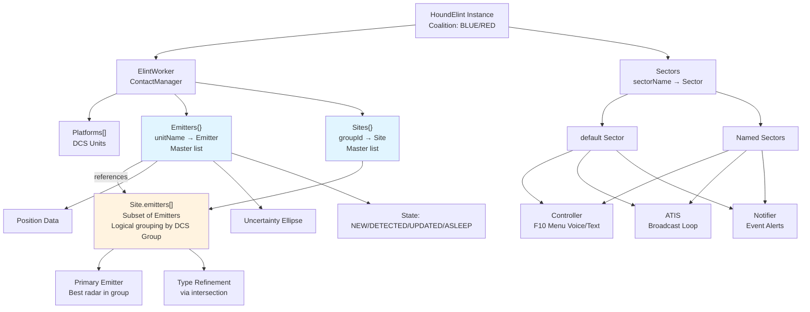
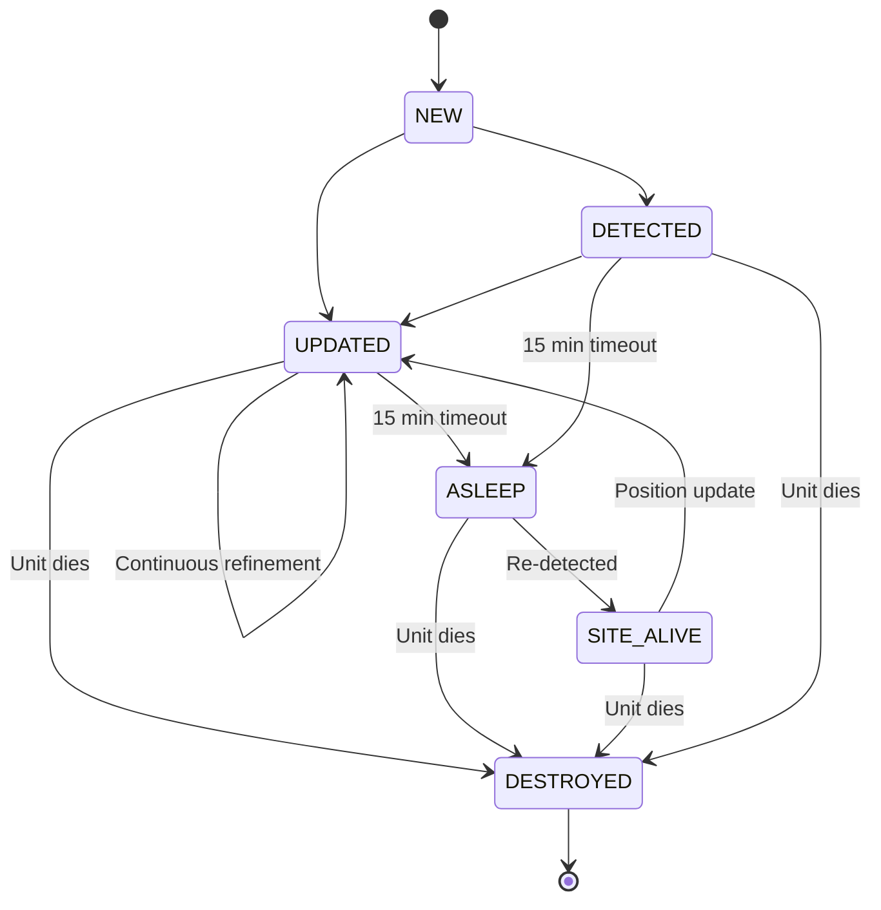
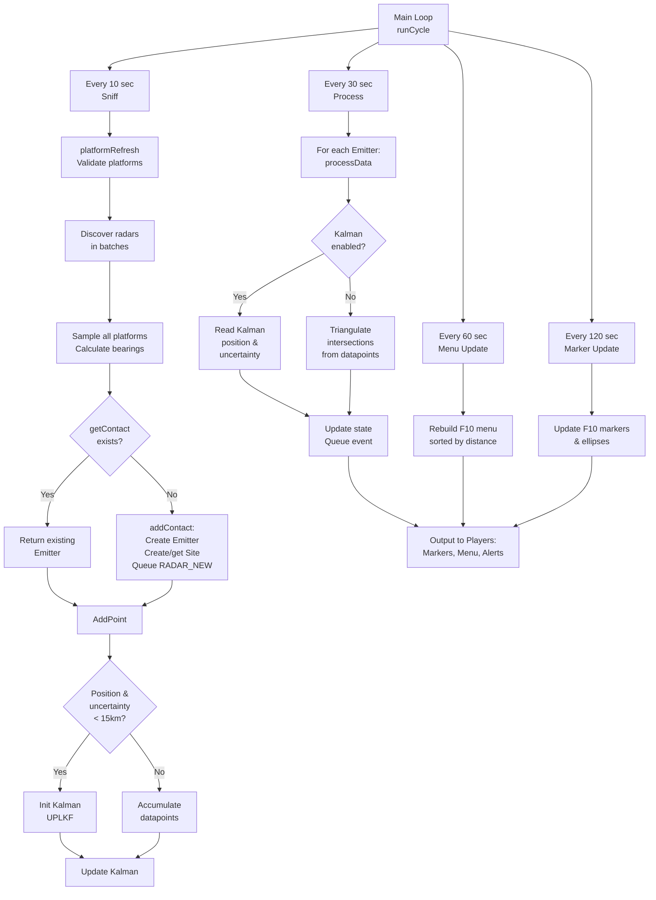

# System Architecture

Technical reference for Hound ELINT internals.

---

## Overview

Hound is a **framework** allowing unlimited independent instances per mission. Each instance has its own coalition, platforms, contacts, and sectors.

```lua
HoundBlue1 = HoundElint:create(coalition.side.BLUE)
HoundBlue2 = HoundElint:create(coalition.side.BLUE)  -- Independent system
HoundRed = HoundElint:create(coalition.side.RED)
```

---

## Component Hierarchy



---

## HoundElint Instance

Main interface object.

**Data:**

```lua
HoundId              -- Unique identifier
Coalition            -- BLUE, RED, NEUTRAL
contacts             -- HOUND.ContactManager (wraps ElintWorker)
sectors              -- {default = Sector, ...}
settings             -- Instance configuration
```

**Key Methods:**

- `addPlatform()` / `removePlatform()`
- `addSector()` / `removeSector()`
- `enableController()` / `enableAtis()` / `enableNotifier()`
- `systemOn()` / `systemOff()`

Instances are completely independent - no data sharing.

---

## ElintWorker

Core intelligence processor accessed via `HOUND.ContactManager.get(HoundId)`.

**Data:**

```lua
ElintWorker.platforms = {}  -- Array of DCS units (detection sources)
ElintWorker.contacts = {}   -- {[unitName] = Emitter} (master list of all detected radars)
ElintWorker.sites = {}      -- {[groupId] = Site} (master list of SAM groups)
                            -- Site.emitters[] contains REFERENCES to subset of contacts
```

**Key Relationship:** Emitters are managed centrally in `contacts`. Sites provide logical grouping by DCS Group, with each site holding references to its emitters. When an emitter is added/removed, the reference in the site is automatically updated.

**Processing Cycles:**

### Scan (~15 sec, Yielding Coroutine)

Discovers active enemy radars and samples them in batches:

1. **Discovery Phase** (yields every ~16 groups):
   - Enumerate enemy coalitions (GROUND + SHIP categories)
   - Find all active radars with LOS capability
   - Yield batches of radar names as discovered

2. **Sampling Phase** (on each batch yield):
   - For each radar in batch + each platform:
     - Check LOS
     - Calculate azimuth/elevation bearing
     - Create Datapoint with angular resolution
     - Call `Emitter:AddPoint(datapoint)`
   - If Kalman initialized: update filter
   - If Kalman not ready: accumulate for later triangulation

3. **Completion**:
   - All radars sampled across multiple sim frames
   - No single frame spike

### Process (~30 sec)

1. For each Emitter:
   - If Kalman enabled: read estimated position from filter
   - Else: triangulate from accumulated datapoints
   - Calculate uncertainty ellipse
   - Update state (NEW → DETECTED → UPDATED → ASLEEP)
   - Update markers
2. For each Site:
   - Update from Emitters
   - Update markers
3. Cleanup timeouts

---

## Platforms

DCS units (aircraft, ground, static) assigned for detection.

**Detection:**

- **LOS required** - Terrain blocking applies
- **Angular resolution** - From antenna size in HOUND.DB
- **Bearing** - Azimuth + elevation (aerial only)
- **Passive only** - No emissions

Platform loss = lose future bearings, existing data remains.

---

## Emitters

`HOUND.Contact.Emitter` - One per detected radar unit.

**Management:** All emitters stored in `ElintWorker.contacts{[unitName] = Emitter}` (master list). Sites hold **references** to a subset of emitters for logical grouping by DCS Group.

**Key Fields:**

```lua
-- Identification
uid                 -- Track ID (ContactId or Unit ID)
DcsObject           -- DCS unit reference
DcsGroupName        -- For site grouping (groups emitters into Sites)
typeName            -- Radar name

-- Classification (from HOUND.DB)
typeAssigned        -- Array: {"SA-2", "SA-3", "SA-5"}
isPrimary           -- Primary tracking radar?
radarRoles          -- {SEARCH, TRACK, ...}
isEWR               -- Early warning radar?

-- Detection
_dataPoints         -- {[platformId] = {Datapoint[]}}
detected_by         -- Platform names[]
state               -- NEW|DETECTED|UPDATED|ASLEEP|DESTROYED
first_seen          -- Timestamp
last_seen           -- Timestamp

-- Position
pos                 -- {p, LL, grid, be, elev}
uncertenty_data     -- {major, minor, theta, az, r}
preBriefed          -- Exact position known?

-- Capabilities
maxWeaponsRange     -- SAM range
detectionRange      -- Radar range
band                -- Frequency band
frequency           -- {[false]=search, [true]=track}
```

**Lifecycle:**



**State Descriptions:**

- **NEW**: Emitter created by `addContact()`. Initial state, no position yet.
- **DETECTED**: Position calculated and valid. Only for non-EWR radars (line 555-556).
- **UPDATED**: Position refined or confirmed. Entered from DETECTED or ASLEEP (line 540, 450).
- **ASLEEP**: No detection for 15 minutes. Datapoints cleared (line 194).
- **SITE_ALIVE**: Radar re-detected after ASLEEP. Position updated (line 448).
- **DESTROYED**: Unit destroyed. Markers removed, state set (line 88).

**Key Transitions:**

1. **NEW → DETECTED/UPDATED**: First `processData()` call with valid position
   - DETECTED if non-EWR (line 555-556)
   - UPDATED if EWR (line 450 Kalman / line 540 Triangulation)

2. **DETECTED/UPDATED → UPDATED**: Continuous refinement on each `processData()`
   - Line 450 (Kalman path): Read position from filter, set RADAR_UPDATED
   - Line 540 (Triangulation path): Triangulate position, set RADAR_UPDATED

3. **DETECTED/UPDATED → ASLEEP**: `CleanTimedout()` after 15 minutes no detection (line 194)

4. **ASLEEP → SITE_ALIVE**: `processData()` detects radar again (line 448 Kalman / line 538 Triangulation)

5. **SITE_ALIVE → UPDATED**: Position updated on next `processData()` (line 450 Kalman / line 540 Triangulation)

6. **Any → DESTROYED**: `destroy()` called when unit dies (line 88)

**Triangulation:**

- Intersect bearing lines from multiple platforms
- Weight by: angular resolution, signal strength, geometry, time
- Uncertainty from: platform count, geometry, resolution, distance

**Pre-Briefed:**

```lua
HoundInstance:preBriefedContact("SA6_Site", "Alpha")
```

Position known exactly, no uncertainty, still tracks state.

---

## Sites

`HOUND.Contact.Site` - SAM batteries/radar groups.

Created when first Emitter from a DCS Group detected.

**Management:** All sites stored in `ElintWorker.sites{[groupId] = Site}` (master list). Each site's `emitters[]` array contains **references** to emitters from `ElintWorker.contacts` that belong to the same DCS Group. This allows logical grouping without data duplication.

**Key Fields:**

```lua
-- Identification
gid                  -- DCS Group ID
DcsObject            -- DCS Group reference
DcsGroupName         -- Group name
DcsRadarUnits        -- Radar units in group (BDA only)

-- Emitters (references to subset of ElintWorker.contacts)
emitters             -- Emitter[] (references, not copies)
primaryEmitter       -- Best radar in group (tracking preferred)
typeAssigned         -- SAM types[] (via intersection of emitter types)

-- Status
state                -- SITE_NEW|SITE_UPDATED|SITE_ASLEEP|...
first_seen           -- Timestamp
last_seen            -- Max of emitters
last_launch_notify   -- Launch alert cooldown
preBriefed           -- Any emitter pre-briefed?

-- Position (from emitters)
pos                  -- From available emitters

-- Capabilities (max from emitters)
maxWeaponsRange      -- Engagement range
detectionRange       -- Detection range
isEWR                -- From primary emitter
```

**Type Refinement via Intersection:**

```lua
-- From Site:updateTypeAssigned()
local type = self.primaryEmitter.typeAssigned
if HOUND.Length(type) > 1 then
    for _,emitter in ipairs(self.emitters) do
        type = HOUND.setIntersection(type, emitter.typeAssigned)
    end
end
Site.typeAssigned = type
```

**Example:**

```
P-19 detected:
  → typeAssigned = {"SA-2", "SA-3", "SA-5"}
  → Display: "SA-2 or SA-3 or SA-5"

Fan Song added:
  → typeAssigned = intersection({"SA-2", "SA-3", "SA-5"}, {"SA-2"})
  → typeAssigned = {"SA-2"}
  → Display: "SA-2"
```

**DCS Group Usage:**

- Group ID for emitter grouping
- `hasRadarUnits()` for BDA checks
- Reference only - does NOT auto-track all radars in group

Sites contain ONLY detected Emitters.

---

## Sectors

Geographic/organizational subdivisions within instance.

Every instance creates "default" sector automatically.

**Structure:**

```lua
Sector.name          -- "default", "North", etc.
Sector.callsign      -- Radio callsign
Sector.zone          -- DCS trigger zone (optional)
Sector.comms         -- {controller, atis, notifier}
```

**Zone Behavior:**

- No zone = all contacts visible
- With zone = only contacts inside
- Multiple zones = highest priority

**Communications per sector (must enable):**

```lua
HoundInstance:enableController("North", {freq = "251.000", modulation = "AM"})
HoundInstance:enableAtis("North", {freq = "253.000", modulation = "AM"})
HoundInstance:enableNotifier("North", {freq = "243.000", modulation = "AM"})
```

---

## Communication Systems

All inherit from `HOUND.Comms.Manager`. Per-sector, must be enabled.

### Controller

F10 radio menu for on-demand queries. Player requests radar info, gets TTS+text response with type, position, status, accuracy.

### ATIS

Broadcasts continuously in loop on frequency. Message content updates every 120 sec (configurable via `setAtisUpdateInterval()`).

**Timing:**

- Transmission scheduler: 4 sec interval (readTime + 4 sec)
- Content refresh: 120 sec (or configured)

Players tune in anytime for current threat summary.

### Notifier

Real-time alerts: launch warnings, BDA, new threats. Typically on guard frequency.

---

## System Timing

| Process     | Default | Purpose                                          |
| ----------- | ------- | ------------------------------------------------ |
| **Scan**    | 10 sec  | Discover + sample radars (batched, yielding)     |
| **Process** | 30 sec  | Triangulate/Kalman, update state                 |
| **Menu**    | 60 sec  | Rebuild F10 menus (atomic, sorted by distance)   |
| **Markers** | 120 sec | Refresh F10 markers (coroutine, yields per site) |
| **ATIS**    | 180 sec | Update message (broadcasts loop)                 |

**Coroutine Cycles:**

- **Scan:** Discovery yields every ~16 groups, each batch sampled immediately (2-3ms per batch)
- **Markers:** Updates all sites, yields per site to spread load
- Both spread across multiple sim frames (~50ms apart)
- No single frame spike, predictable per-frame cost

**Menu Details:**

- Rebuilt atomically (no yielding)
- Items sorted by distance (closest first), then by recency, then alphabetically
- Re-entry guard prevents overlapping rebuilds

Configure via `setTimerInterval("scan", 20)` etc.

---

## Detection Data Flow

**Platform Validation (Before Radar Discovery):**

Before discovering radars, the system validates all platforms:

1. **platformRefresh()** (line 115 in runCycle):
   - Check `isExist()` and `getLife() < 1`
   - Remove dead platforms
   - Queue PLATFORM_DESTROYED event

2. **removeDeadPlatforms()** (line 450 in Sniff):
   - Additional check: `isActive() == false` for non-static platforms
   - Ensures only active platforms are used for sampling

**Key Parallel Branches (After Radar Discovery):**

The flow splits at `getContact()`:

1. **Existing Emitter Path** (line 217 in code):
   - Contact already exists in `ElintWorker.contacts`
   - Return immediately, skip to AddPoint

2. **New Emitter Path** (lines 218-220 in code):
   - Contact doesn't exist
   - Call `addContact()` to create:
     - Create Emitter (state: NEW)
     - Get or create Site (first radar in group)
     - Add emitter reference to site
     - Queue RADAR_NEW event
   - Return new contact

Both paths converge at `AddPoint()` where datapoints are either fed to Kalman filter (if ready) or accumulated for triangulation.

**Kalman Initialization & Process Cycle:**

1. **AddPoint (Scan Cycle)** - Lines 234-237:
   - If position exists AND uncertainty radius < 15km, initialize UPLKF Kalman estimator
   - Once initialized, all future datapoints update the Kalman filter (not accumulated)
   - If no Kalman: datapoints accumulated for triangulation in Process cycle

2. **processData (Process Cycle)** - Lines 438-469:
   - **If Kalman enabled** (lines 438-469): "Fast path" - minimal work
     - Read estimated position from Kalman filter
     - Extract uncertainty ellipse from covariance matrix
     - Update state (UPDATED or DETECTED)
     - Return immediately (skip expensive triangulation)
   - **If no Kalman** (lines 472+): Triangulate from accumulated datapoints
     - Intersect bearing lines from multiple platforms
     - Calculate weighted centroid
     - Compute uncertainty ellipse from point cluster
     - Update state
     - Once position is good, Kalman will initialize on next Scan cycle



---

## Key Behaviors

**Geometry Impact:**

- Perpendicular platforms: small uncertainty
- Parallel platforms: large uncertainty

**Accuracy Progression:**

- Initial: ±2 km
- 2 min: ±800 m
- 5 min: ±300 m
- 10 min: ±150 m

**Platform Loss:**

- Lose future bearings from destroyed platform
- Existing data persists
- Creates strategic value for ELINT assets

**Framework Design:**

- Multiple instances supported (no limit per coalition)
- Instances independent (separate platforms, contacts, sectors)
- Sectors optional (default only for simple missions)
- Communications optional (works with markers only)

---

## Performance

| Scenario        | Instances      | Platforms                        | Radars |
| --------------- | -------------- | -------------------------------- | ------ |
| **PvE**         | 1              | 2-4 dedicated + dynamic fighters | Varies |
| **PvP**         | 2 (Blue + Red) | 2-4 dedicated + dynamic fighters | Varies |
| **Stress test** | 1+             | 2-4 dedicated + dynamic fighters | ~900   |

**Notes:**

- Datapoint cap (`HOUND.DATAPOINTS_NUM = 30`) limits memory per Emitter
- **Radar count is primary performance factor**, not platform count
- Hound core processing: ~2ms per position update cycle (even with ~900 radars)
- **MP performance bottlenecks:**
  - TTS transmission handling (HoundTTS/STTS)
  - DCS script execution
  - Map marker updates (DCS limitation)
  - May cause lags in some scenarios

**Optimization:**

- Increase scan/process intervals
- Reduce marker update frequency (biggest impact in MP)
- Disable unnecessary communications
- Use sectors to divide workload

---

## Coroutine Scheduler

Hound uses a collaborative coroutine scheduler to spread expensive operations across multiple sim frames, preventing frame spikes.

**Operations Using Coroutines:**

1. **Scan (Radar Discovery + Sampling)** — Discovers radars in batches, samples each batch immediately
2. **Markers** — Updates all contact markers, yields per site

**How It Works:**

1. **Discovery Phase** — `getActiveRadarsYielding()` enumerates enemy groups and yields every ~16 groups
2. **Batch Callback** — On each yield, `onYield` callback receives the batch of discovered radars
3. **Sampling Phase** — Callback immediately samples that batch against all platforms
4. **Spread Load** — Work is distributed across frames (~50ms apart)

**Example Timeline (100 radars):**

```text
Frame 1 (t=0ms):   Discover radars 1-16  → Sample all platforms (2ms)
Frame 2 (t=50ms):  Discover radars 17-32 → Sample all platforms (2ms)
Frame 3 (t=100ms): Discover radars 33-48 → Sample all platforms (2ms)
...
Frame 7 (t=300ms): Discover radars 97-100 → Sample all platforms (1ms)
```

**Benefits:**

- No single frame spike (predictable 2-3ms per frame)
- Responsive UI (no frame hitches)
- Scales to 100+ radars without optimization
- Kalman updates happen immediately per batch

**Technical Details:**

- Scheduler: `HOUND.Coroutine` (in `011 - HoundCoroutine.lua`)
- Pump interval: 50ms (configurable via `YieldInterval`)
- Batch size: 16 groups per yield (in `getActiveRadarsYielding`)
- Callback: `onYield(nil, batch)` on yield, `onYield(Radars, nil)` on completion

---

## See Also

- [LLM Integration Guide](../llm-integration-guide.md) - API reference and integration examples
- [How It Works](how-it-works.md) - Triangulation deep dive
- [Event Handlers](event-handlers.md) - Custom scripting
