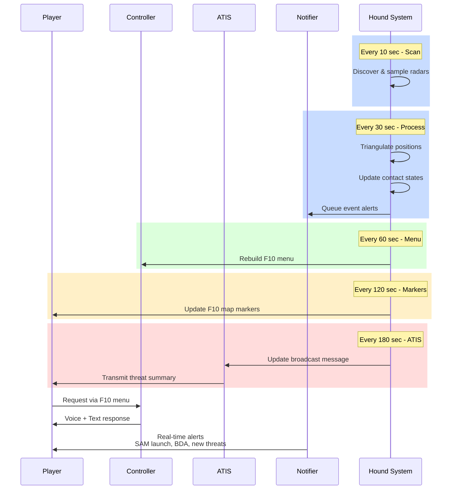

# Communication Systems

Three systems deliver intelligence: ATIS (continuous broadcast), Controller (on-demand F10 menu), Notifier (event alerts).

---

## System Comparison

| Feature      | ATIS          | Controller           | Notifier     |
| ------------ | ------------- | -------------------- | ------------ |
| **Type**     | Voice loop    | Voice/Text on-demand | Voice alerts |
| **F10 Menu** | No            | Yes                  | No           |
| **Updates**  | Every 3 min   | Real-time            | On events    |
| **Detail**   | Summary       | Full                 | Brief        |
| **Best for** | SA monitoring | Targeting            | Awareness    |

### Timing & Interaction



---

## Setup Examples

**Simple (one frequency):**

```lua
HoundBlue:enableController({freq = "251.000", modulation = "AM"})
```

**Standard (all three systems):**

```lua
HoundBlue:enableController({freq = "251.000", modulation = "AM"})
HoundBlue:enableAtis({freq = "253.000", modulation = "AM"})
HoundBlue:enableNotifier({freq = "243.000", modulation = "AM"})
```

**Multi-sector:**

```lua
HoundBlue:addSector("North")
HoundBlue:enableController("North", {freq = "251.000", modulation = "AM"})
HoundBlue:enableAtis("North", {freq = "253.000", modulation = "AM"})

HoundBlue:addSector("South")
HoundBlue:enableController("South", {freq = "255.000", modulation = "AM"})
```

---

## Frequency Planning

**Typical usage:**

- 251.000 AM - Controller
- 253.000 AM - ATIS
- 243.000 AM - Notifier (guard)
- 35.000 FM - Ground frequencies

**Multiple frequencies:**

```lua
HoundBlue:enableController({freq = "251.000,35.000", modulation = "AM,FM"})
```

---

## Text Messages

Enable text output for Controller (requires players to "Check In" via F10 menu):

```lua
HoundBlue:enableText("sectorName")
HoundBlue:disableText("sectorName")
```

---

## Transmitters

Add realistic radio range/LOS requirements:

```lua
HoundInstance:setTransmitter("sectorName", "AWACS_Unit")
HoundInstance:removeTransmitter("sectorName")
```

---

## Alert Control

```lua
HoundInstance:enableBDA()              -- Destroyed radar alerts
HoundInstance:setAlertOnLaunch(true)   -- SAM launch alerts
HoundInstance:disableAlerts("sectorName")  -- Disable Controller alerts
```

---

## Sector Callsigns

```lua
local callsign = HoundInstance:getCallsign("sectorName")
HoundInstance:setCallsign("sectorName", "OVERLORD")
HoundInstance:setCallsign("sectorName", "NATO")  -- Random NATO callsign
HoundInstance:useNATOCallsignes(true)            -- NATO for all sectors
```

---

## Configuration Examples

```lua
-- Voice + text
HoundBlue:enableController({freq = "251.000", modulation = "AM"})
HoundBlue:enableText("default")

-- With transmitter (realistic)
HoundBlue:setTransmitter("default", "AWACS")
HoundBlue:enableController({freq = "251.000", modulation = "AM"})

-- Multi-frequency
HoundBlue:enableNotifier({freq = "243.000,121.500", modulation = "AM,AM"})
```

---

**📖 Detailed guides:** [Controller](controller.md) | [ATIS](atis.md) | [Notifier](notifier.md) | [TTS Config](tts-configuration.md) | [Sectors](sectors.md)
