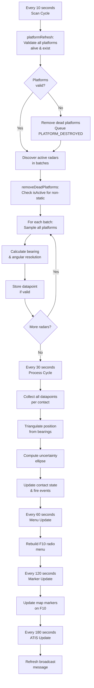

# How Hound Works

Understanding the principles behind Hound ELINT will help you use it effectively.

---

## The Basics: Triangulation

Hound simulates **Direction Finding (DF)** and **triangulation** to locate enemy radars.

### Simple Explanation:

1. **Radar Transmits** - Enemy SAM radar turns on
2. **Platform Detects** - ELINT platform receives the signal and measures bearing
3. **Multiple Bearings** - Each platform records bearing from its position
4. **Triangulation** - Lines of bearing intersect to estimate radar position
5. **Refinement** - More measurements improve accuracy over time

### Visual Concept:

```
    Platform A ────────────┐
                           │
                           ▼
                      [Enemy Radar]
                           ▲
                           │
    Platform B ────────────┘
```

Where the lines cross is the estimated position.

---

## Key Concepts

### 1. Line of Sight

**Platforms can only detect radars they can "see".**

- Higher altitude = longer detection range
- Terrain blocks signals (mountains, hills)
- Earth curvature limits range
- Radar must be transmitting

### 2. Position Accuracy

**Accuracy improves with:**

✅ **More platforms** - More lines of bearing = better triangulation
✅ **Better geometry** - Platforms at different angles give better intersections
✅ **Closer platforms** - Less angular error accumulation
✅ **Higher precision platforms** - Better equipment = more accurate bearings
✅ **More time** - Additional measurements refine the solution

❌ **Accuracy degrades with:**

- Single platform (needs at least 2)
- Poor geometry (platforms in line)
- Greater distance
- Low precision platforms
- Rapid platform movement

### 3. Uncertainty Ellipse

The uncertainty ellipse shows confidence in the position estimate:

- **Small ellipse** = High confidence, accurate position
- **Large ellipse** = Low confidence, wide search area
- **Ellipse orientation** = Geometry of detection (usually perpendicular to platform line)

---

## Platform Capabilities

### Resolution and Frequency

Platform accuracy depends on **antenna size** and **signal frequency**.

**Frequency Bands:**

- **A-Band:** Lowest frequencies, easiest to detect accurately
- **B-Band:** Low frequencies
- **C-Band:** Medium frequencies (most SAM radars)
- **H-Band:** High frequencies, harder to pinpoint

**Antenna Size:**

- Large aircraft (C-130, C-17) = Large antennas = Better resolution
- Small aircraft (fighters) = Small antennas = Lower resolution
- Static towers = Very large antennas = Excellent resolution

### Minimum Band

Each platform has a "minimum band" - the lowest frequency it can accurately process.

Example:

- **C-130:** Minimum Band A (can detect all radars accurately)
- **F-16:** Minimum Band D (struggles with low-frequency radars)

**Rule:** Hound rejects data with >10° angular error to avoid bad positioning.

📖 **Platform specifications:** [Available Platforms](platforms.md)

---

## Detection Process

### What Happens Each Cycle:



### Initial Detection

**First Detection (0-30 seconds):**

- Contact appears but may have poor position
- Large uncertainty ellipse
- "Estimated" accuracy rating

**After 1-2 Minutes:**

- Multiple datapoints collected
- Position stabilizes
- Uncertainty ellipse shrinks
- "High" or "Very High" accuracy

**Steady State:**

- Continuous refinement
- Stable, accurate position
- Tracks radar movement (if mobile)

---

## Accuracy Ratings

Hound categorizes accuracy into descriptive terms:

| Rating           | Meaning           | Uncertainty   |
| ---------------- | ----------------- | ------------- |
| **Very High**    | Pinpoint accuracy | < 500m radius |
| **High**         | Strike-ready      | 500m - 1km    |
| **Medium**       | General location  | 1km - 3km     |
| **Low**          | Approximate area  | 3km - 10km    |
| **Unactionable** | Too uncertain     | > 10km        |

**Note:** Actual thresholds depend on ellipse size and geometry.

---

## Platform Positioning

### Best Practices:

**Altitude:**

- **High is Better:** 25,000+ ft for fixed-wing
- **Trade-offs:** Survival vs detection range
- **Static objects:** Place on highest terrain available

**Spacing:**

- **Wide separation:** 50+ nm between platforms for long-range targets
- **Converging angles:** 45-90° ideal intersection angle
- **Avoid collinear:** Don't place platforms in a straight line

**Coverage:**

- **Racetrack patterns:** Constant, predictable coverage
- **Orbit locations:** Cover different aspects of battlespace
- **Ground stations:** Excellent baseline for airborne platforms

### Example Layouts:

**Large Area Coverage:**

```
Platform A (North) ──── Racetrack at 30,000 ft
Platform B (South) ──── Racetrack at 30,000 ft
Platform C (West)  ──── Fixed ground station
```

**Focused Coverage:**

```
Platform A ──── Orbit target area from east
Platform B ──── Orbit target area from west
Platform C ──── High-altitude overwatch from north
```

---

## Contact Lifecycle

### States:

**Active** - Radar currently transmitting, fresh datapoints
**Recent** - Radar off < 2 minutes, recent position valid
**Stale** - Radar off 2-5 minutes, position aging
**Aged** - Radar off 5-10 minutes, position questionable
**Asleep** - Radar off > 10 minutes, removed from ATIS
**Timeout** - No detection for extended period, removed entirely

### Marker Behavior:

- **Active radars:** Full opacity markers
- **Recent:** Slight fade
- **Stale/Aged:** Progressive fade
- **Removed:** Marker deleted

---

## Position Errors (Simulation)

Hound can simulate realistic platform position errors:

```lua
HoundInstance:enablePlatformPosErrors()
```

**Simulates:**

- INS drift over time
- GPS accuracy variations
- Position reporting errors

**Result:**

- Slightly less perfect triangulation
- More realistic uncertainty
- Better training value

**Recommended:** Enable for realistic training missions

---

## Advanced Concepts

### Pre-Briefed Contacts

You can provide exact positions for known sites:

```lua
HoundInstance:preBriefedContact("SAM_Site_1")
HoundInstance:preBriefedContact("SAM_Group_2", "ANVIL")  -- Custom name
```

**Behavior:**

- Exact position (from unit location)
- Zero uncertainty
- Marked as "Pre-Briefed"
- If radar moves >100m, reverts to normal tracking

**Use Cases:**

- Known, stationary SAM sites
- Briefed coordinates for strikes
- Training scenarios with fixed positions

### Contact Grouping (Sites)

Hound automatically groups related radars into "sites":

**SA-6 Site Example:**

- **Straight Flush** (Track radar)
- **Straight Flush** (Optional second radar)
- Launchers (not tracked, but associated)

**Display:**

- Individual radar markers
- Site marker with NATO designation
- Menu organized by site

### Launch Detection Intelligence

When a SAM launches a missile, Hound performs additional intelligence gathering:

**Automatic Actions on SAM Launch:**

1. **Immediate Sniff** - Forces an immediate position update for the launching site
2. **Target Acquisition** - Attempts to determine weapon target and position
3. **Site Primary Update** - Ensures the site's primary radar has accurate position data
4. **Launch Alert** - Triggers launch alert if enabled

**What This Means:**

- Launch detection is extremely responsive
- Position data is refreshed at moment of launch
- Better accuracy for counter-battery fire
- Launch alerts include best-available position

**Event Processing:**

Only processes launches that meet all criteria:

- ✅ Enemy unit (opposite coalition)
- ✅ Has "Air Defence" attribute
- ✅ Ground or ship unit (not aircraft)
- ✅ Weapon is missile (not guns)

**Enable Launch Alerts:**

```lua
HoundInstance:setAlertOnLaunch(true)
```

Launch alerts are broadcast via Notifier on configured frequencies (typically guard).

---

## Limitations

### What Hound Cannot Do:

❌ Detect radars that are off
❌ See through terrain or earth curvature
❌ Work with zero platforms
❌ Provide instant perfect positions
❌ Track units that don't emit

### Initial Detection Quirks:

⚠️ **First Position Often Wrong**

- Initial calculation may place contact far from actual
- Usually corrects within 1-2 minutes
- Wait for multiple datapoints before acting

⚠️ **Low Resolution Platforms**

- Adding poor platforms can degrade solution
- Hound rejects >10° error but lower precision still impacts
- Use best available platforms when possible

---

## Performance Factors

### What Affects Processing:

**Number of:**

- Active enemy radars
- ELINT platforms
- Datapoints per contact
- Marker updates

**Large Missions (50+ radars):**

- Consider increasing timer intervals
- Reduce marker complexity
- Disable markers entirely

📖 **Optimization guide:** [Performance Tuning](performance.md)

---

## Real-World Inspiration

Hound simulates concepts from real ELINT operations:

- **Direction Finding:** Measuring signal bearing
- **Triangulation:** Multi-platform position fixing
- **ELINT Platforms:** RC-135, EA-18G, ground stations
- **ELINT Products:** Position, accuracy, confidence

**Differences from Reality:**

- Simplified frequency/modulation handling
- No signal strength analysis
- Perfect bearing measurement (within platform limits)
- No jamming or deception

---

## Summary

**For Best Results:**

1. Use **2+ platforms** with good separation
2. Fly **high** for maximum range
3. Maintain **diverse geometry** (different angles)
4. Allow **1-2 minutes** for positions to stabilize
5. Use **precision platforms** when available
6. Place **ground stations** on high terrain

**Understanding leads to better employment:**

- Platform selection and positioning
- Realistic expectations for accuracy
- Proper mission planning
- Effective use of intelligence products

---

## Next Steps

- **Choose platforms:** [Available Platforms](platforms.md)
- **Configure system:** [Basic Configuration](basic-configuration.md)
- **Customize markers:** [Map Markers](map-markers.md)
- **Add communications:** [Communication Systems](communication.md)
