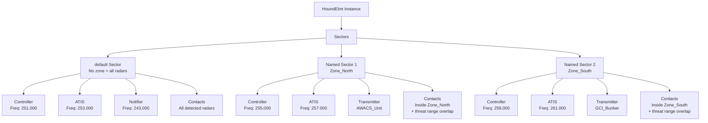
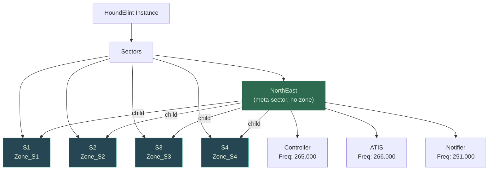
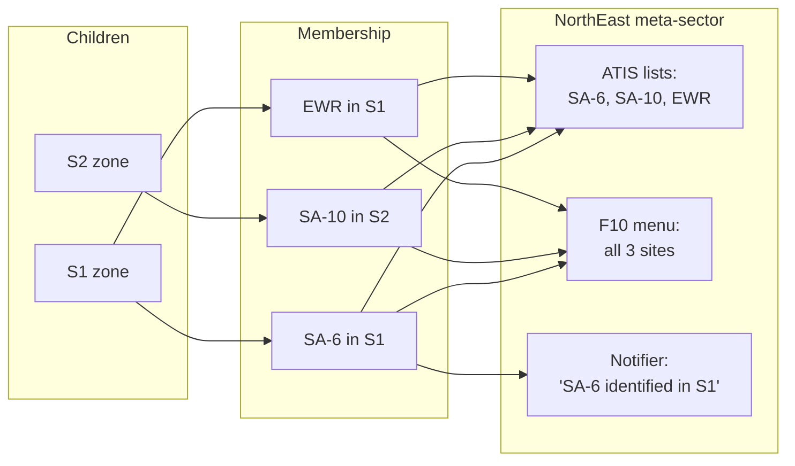
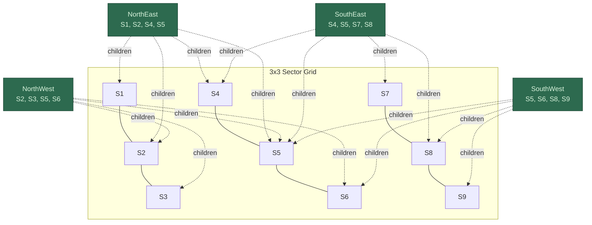

# Sectors and Zones

Organize large missions by dividing them into regions with separate controllers and zones.

---

## Sectors

A sector groups communication elements (Controller, ATIS, Notifier) with optional geographic boundaries (Zones).

**Components:**

- Name, callsign
- Controller, ATIS, Notifier (optional)
- Zone (optional geographic boundary)
- Transmitter (optional)

**Use multiple sectors for:** Large missions, multiple regions, 30+ radars, different frequencies per area  
**Use single sector for:** Small missions, single AO, <20 radars

### Sector Organization



---

## Default Sector

Every instance has a "default" sector (cannot be removed, reports all radars unless zones are set).

```lua
HoundBlue = HoundElint:create(coalition.side.BLUE)
HoundBlue:addPlatform("ELINT_1")
HoundBlue:enableController({freq = "251.000", modulation = "AM"})
HoundBlue:systemOn()
```

---

## Creating Sectors

```lua
HoundInstance:addSector("North Syria")
HoundInstance:removeSector("North Syria")
local sectors = HoundInstance:listSectors()
```

Sector names are case-sensitive and must be unique. Cannot remove "default" sector.

---

## Geographic Zones

Without zone: Sector reports all radars  
With zone: Sector reports radars inside zone + threat range overlap

**Creating zones:**

```lua
-- Method 1: Drawing tool polygon in mission editor
HoundInstance:setZone("North", "Zone_North")

-- Method 2: Group waypoints (helo/ground group defining boundary)
HoundInstance:setZone("North", "Helo_Boundary_Group")

-- Method 3: Auto-name (if "North Sector" polygon exists)
HoundInstance:setZone("North")

-- Remove zone
HoundInstance:removeZone("North")
```

**Threat range:** Radars near zone edges are included if their weapon range overlaps the zone (e.g., SA-10 with 60NM range).

---

## Configuring Sectors

Most functions accept sector name as first parameter:

```lua
-- Default sector (omit name)
HoundInstance:enableController({freq = "251.000", modulation = "AM"})

-- Specific sector
HoundInstance:enableController("North", {freq = "251.000", modulation = "AM"})
HoundInstance:enableAtis("North", {freq = "253.000", modulation = "AM"})
HoundInstance:enableText("North")
HoundInstance:setTransmitter("North", "AWACS_Unit")
HoundInstance:setCallsign("North", "DARKSTAR")

-- Apply to all sectors (generic settings only)
HoundInstance:enableText("all")
HoundInstance:setTransmitter("all", "GCI_Bunker")
```

---

## Sector Callsigns

Auto-assigned on creation: "HOUND" (default sector), random from pool (others)

```lua
local callsign = HoundInstance:getCallsign("North")

-- Set custom
HoundInstance:setCallsign("North", "OVERLORD")

-- Random from NATO pool (real RC-135 callsigns)
HoundInstance:setCallsign("North", "NATO")

-- Enable NATO for all sectors
HoundInstance:useNATOCallsignes(true)
```

---

## Multi-Sector Example

```lua
HoundBlue = HoundElint:create(coalition.side.BLUE)
HoundBlue:addPlatform("ELINT_1")
HoundBlue:addPlatform("ELINT_2")

-- Create sectors with zones
HoundBlue:addSector("North")
HoundBlue:addSector("South")
HoundBlue:setZone("North", "Zone_North")
HoundBlue:setZone("South", "Zone_South")

-- Configure each sector
HoundBlue:enableController("North", {freq = "251.000", modulation = "AM"})
HoundBlue:enableAtis("North", {freq = "253.000", modulation = "AM"})

HoundBlue:enableController("South", {freq = "255.000", modulation = "AM"})
HoundBlue:enableAtis("South", {freq = "257.000", modulation = "AM"})

-- Global notifier
HoundBlue:enableNotifier({freq = "243.000", modulation = "AM"})

HoundBlue:systemOn()
```

---

## Reserved Names

**"default":** Auto-created, cannot be removed, reports all radars  
**"all":** Keyword for global settings (works with `enableText()`, `setTransmitter()`, `reportEWR()` - NOT with `enableController()`/`enableAtis()`)

---

## Sector-Specific Settings

```lua
HoundInstance:enableText("North")
HoundInstance:disableTTS("North")  -- Text only
HoundInstance:disableAlerts("North")
HoundInstance:reportEWR("North", true)
```

---

## Meta-Sectors

A meta-sector aggregates multiple child sectors without a zone of its own. Attach a Controller, ATIS, or Notifier to a meta-sector and it will report on contacts from all its children. Child sectors only need a zone — no comms required on them.



### How it works



- **Notifications** include the child sector name: _"SA-6 identified in S1"_
- **ATIS** aggregates all sites from all children (deduplicated)
- **F10 menus** show all sites from all children
- **Controller alerts** also include the child sector name
- The meta-sector itself has **no zone** — it never claims ownership of contacts

### Creating meta-sectors

```lua
-- Create child sectors (zone only, no comms needed)
HoundBlue:addSector("Beslan")
HoundBlue:setZone("Beslan", "Zone_Beslan")

HoundBlue:addSector("Vladikavkaz")
HoundBlue:setZone("Vladikavkaz", "Zone_Vlad")

-- Create meta-sector and assign children
HoundBlue:addSector("Northern Front")
HoundBlue:addChildSector("Northern Front", "Beslan")
HoundBlue:addChildSector("Northern Front", "Vladikavkaz")

-- Attach comms to the meta-sector
HoundBlue:enableController("Northern Front", {freq = "265.000", modulation = "AM"})
HoundBlue:enableAtis("Northern Front", {freq = "266.000", modulation = "AM"})
HoundBlue:enableNotifier("Northern Front", {freq = "251.000", modulation = "AM"})

-- Remove a child
HoundBlue:removeChildSector("Northern Front", "Vladikavkaz")
```

### Overlapping meta-sectors

A child sector can belong to multiple meta-sectors. When a contact is detected in a shared child, all meta-sectors containing that child fire independently.



In this example, S5 is a child of all four meta-sectors. A contact in S5 triggers notifications on NE, NW, SE, and SW. Each meta-sector deduplicates contacts — a contact in both S2 and S5 appears once in NorthEast's ATIS, not twice.

```lua
-- Grid setup
for i = 1, 9 do
    HoundBlue:addSector("S"..i, { zone = "Zone_S"..i })
end

-- Overlapping meta-sectors
HoundBlue:addSector("NorthEast")
HoundBlue:addChildSector("NorthEast", "S1")
HoundBlue:addChildSector("NorthEast", "S2")
HoundBlue:addChildSector("NorthEast", "S4")
HoundBlue:addChildSector("NorthEast", "S5")

HoundBlue:addSector("NorthWest")
HoundBlue:addChildSector("NorthWest", "S2")
HoundBlue:addChildSector("NorthWest", "S3")
HoundBlue:addChildSector("NorthWest", "S5")
HoundBlue:addChildSector("NorthWest", "S6")

HoundBlue:enableNotifier("NorthEast", {freq = "251.000", modulation = "AM"})
HoundBlue:enableNotifier("NorthWest", {freq = "252.000", modulation = "AM"})
```

### Restrictions

- Reserved sectors (`"default"`, `"all"`) cannot have child sectors
- A meta-sector should not have its own zone — it purely aggregates children
- Child sectors only need a zone; no controller/ATIS/notifier required on them

---

## Troubleshooting

**Radar not in expected sector:** Verify zone name/boundaries with `getZone()`, check weapon range overlap

**Sector menu missing:** Verify sector created, Controller enabled for sector, system activated

**Meta-sector showing no contacts:** Verify child sectors have zones and are created before contacts are detected. Use `getSector()` to retrieve the meta-sector and call `hasChildSector("childName")` on it to verify children are assigned without mutating runtime state.

---

## Dynamic Sectors

```lua
-- Add/remove during mission
HoundBlue:addSector("Reinforcement Area")
HoundBlue:setZone("Reinforcement Area", "Zone_Reinf")
HoundBlue:enableController("Reinforcement Area", {freq = "259.000", modulation = "AM"})

HoundBlue:removeSector("Reinforcement Area")
```
